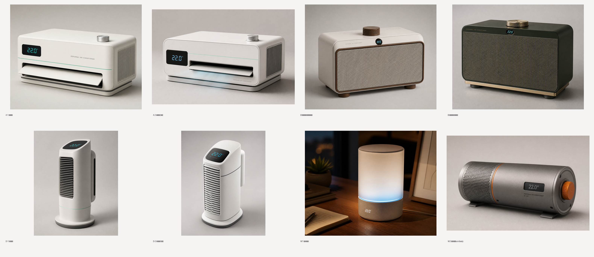
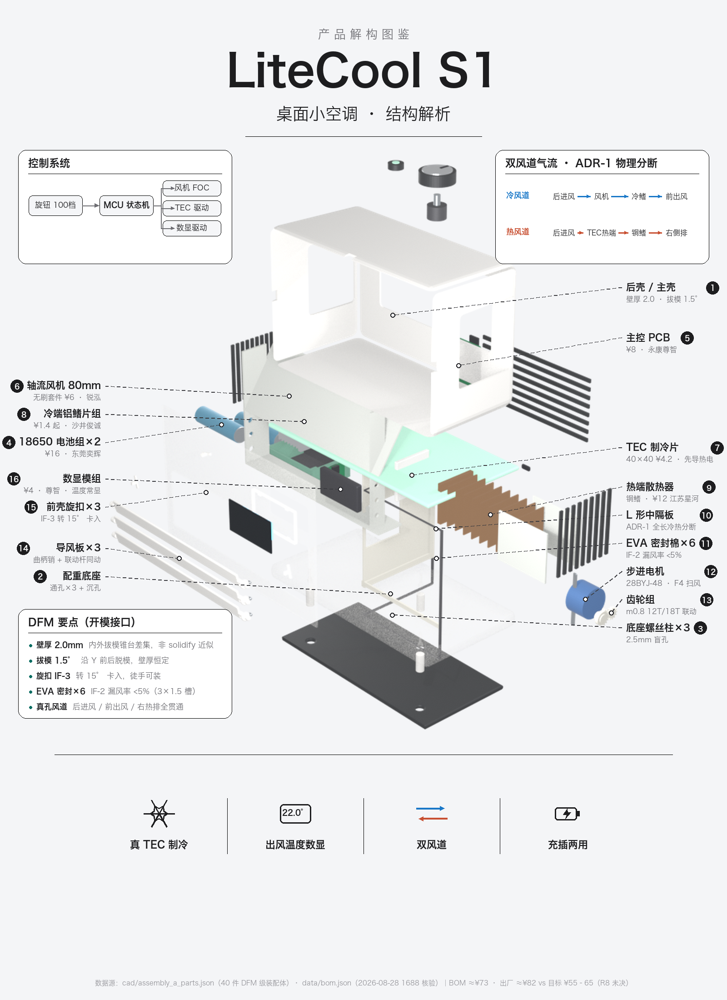

# LiteCool S1 · 桌面小空调

> 给工位/宿舍/床头**一个人**降温的桌面小空调——TEC 半导体制冷，不是风扇。
> 本仓库是它的完整研发资产：从竞品证据到工程装配体到供应链对接，全流程公开。



## 三大差异化

1. **降温看得见**——出风口温度实时数显。我们实抓了淘宝 13 款制冷竞品，**没有一款**显示出风温度；kinglucky（¥168）的差评原话是"就是普通风扇并没有制冷"。数显一票否决伪制冷话术。
2. **双风道热架构**——冷风道（进风→风机→TEC 冷端鳍片→导风板出风）与热风道（独立进风→热端散热器→侧后排出）物理隔离，这是"空调"的物理基础（ADR-1）。
3. **每个结构件都能落地**——BOM 8 个模块全部有 1688 候选厂（核验等级标注），工程装配体 40 个零件逐件挂供应商。

## 产品速览

- 形态：**A 桌面挂机**（已选定；B 复古收音机、D 塔·认真版为备份基线，三套工程装配体均已建成）
- SKU：Cool ¥119–129 / Pro ¥159（双 SKU）
- 规格亮点：出风降温 ≤ 环温 −4°C（插电档）· ≤35dB(A)@30cm 静音档 · 100 档无级 · 导风板 ±30° 扫风 · 充插两用
- 合规纪律：专利预检索 12 件逐条核验 + 逐方向规避设计成文；开模前正式 FTO



## 研发流水线（S0–S9）

需求 → 竞品调研 → 形态/专利/供应链 → 成本核算 → 3D 建模 → 人类验收 → 手板验证 → FTO+开模。
每个阶段有数据闸：空壳数据进不了呈现层，未核验的宣称带 ⚠️，所有拍板记录在 `data/decisions.json`。

**工程工作台**（本项目控制室，2026-08-30 已切换为 v2 新前端——ES-module 组件架构+文档排印设计；旧版 `dist/workbench.html` 为 legacy）：`cd puzhi-fan && python3 -m http.server 8765`，打开
`http://localhost:8765/workbench/dist/index.html`——六视图：流水线总览 / 竞品分析 / 形态对比 / 3D 拆分+供应链（爆炸·透视·标注·点零件弹 BOM 卡）/ 专利规避 / 需求与决策。

```bash
python3 pipeline/run.py status     # S0–S9 阶段状态
python3 pipeline/run.py validate   # 数据完整度闸
python3 pipeline/run.py build      # 重建工作台
```

## 文档地图

**第一站 → [docs/PRODUCT.md](docs/PRODUCT.md)**（整个产品的架构：两层系统 + 文档体系 + 包架构）

| 主题 | 位置 |
|---|---|
| 产品定义（唯一事实源） | [design-spec.md](design-spec.md) |
| 需求基线 | [requirements/requirements-brief.md](requirements/requirements-brief.md) |
| 硬件系统架构 | [architecture/product-architecture.md](architecture/product-architecture.md) |
| 形态方向与决策 | [design/form-directions.md](design/form-directions.md) |
| 竞品研究（13 款实抓） | [research/](research/) |
| 专利预检索与规避设计 | [research/patent_avoidance.md](research/patent_avoidance.md) |
| 供应链（1688 供应商+询价） | [research/1688_factories.md](research/1688_factories.md)、[rfq/](rfq/) |
| 工程装配体与图鉴管线 | [cad/](cad/)（`assembly_eng_notes.md` 等） |
| S8 手板验证计划 | [docs/S8_prototype_test_plan.md](docs/S8_prototype_test_plan.md) |

## 当前状态（2026-08-30）

S0–S6 完成；决策已录（Q1=A 形态 / Q2 砍风冷款 / Q3 询价压实+¥129 兜底）；两家 ODM（蓝鲸喜、臻源）进入实质流程，NDA 签署后外发受控资料包；下一步：报价压实 → 功能样机 → T1–T7 热架构实测 → 正式 FTO → 开模。

---

> 研究级公开项目，非量产承诺。所有性能宣称带测量条件；标注"待验证"的规格以手板实测为准。
